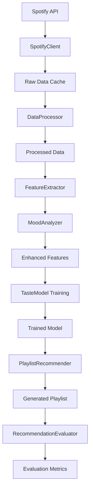

# Development Guide - Playlist Auto-DJ

This guide provides comprehensive information for developers working on the Playlist Auto-DJ system.

## 🏗️ Architecture Overview

The system follows a modular architecture with clear separation of concerns:

```
playlist-auto-dj/
├── src/
│   ├── data/           # Data ingestion and processing
│   ├── features/       # Feature engineering and mood analysis
│   ├── models/         # ML models and recommendation engine
│   ├── evaluation/     # Metrics and evaluation
│   └── app/           # Web interface
├── config/            # Configuration files
├── tests/             # Test suites
└── data/              # Data storage (created at runtime)
```

## 🔧 Core Components

### 1. Data Pipeline (`src/data/`)

**SpotifyClient** (`spotify_client.py`)
- Handles Spotify Web API integration
- Manages authentication and rate limiting
- Fetches user playlists, tracks, and audio features
- Implements comprehensive data collection strategies

**DataProcessor** (`data_processor.py`)
- Cleans and validates raw data
- Handles missing values and outliers
- Merges track metadata with audio features
- Creates training labels for ML models

**CacheManager** (`cache_manager.py`)
- Efficient data storage and retrieval
- Handles caching of API responses and processed data
- Supports multiple storage formats (Parquet, JSON, Pickle)
- Implements cache expiration and cleanup

### 2. Feature Engineering (`src/features/`)

**MoodAnalyzer** (`mood_analyzer.py`)
- Rule-based mood classification system
- Supports 6 mood categories: happy, sad, energetic, calm, focus, party
- Calculates mood scores using weighted audio features
- Optional ML-based mood refinement

**FeatureExtractor** (`feature_extractor.py`)
- Creates 50+ engineered features from raw audio data
- Interaction features (valence × energy, etc.)
- Composite indices (happiness, intensity, etc.)
- Statistical features and clustering-based features

### 3. Machine Learning (`src/models/`)

**TasteModel** (`taste_model.py`)
- User preference modeling with multiple algorithms
- Baseline: Logistic Regression
- Advanced: LightGBM with hyperparameter tuning
- Handles imbalanced data and feature selection

**PlaylistRecommender** (`recommender.py`)
- Multi-criteria recommendation engine
- Mood-based filtering with range constraints
- Content-based similarity using cosine distance
- Exploration-exploitation balance
- Diversity optimization

### 4. Evaluation (`src/evaluation/`)

**RecommendationEvaluator** (`metrics.py`)
- Comprehensive offline evaluation metrics
- Precision@K, Recall@K, F1@K, MAP, NDCG
- Diversity and novelty scoring
- Online feedback processing and analysis

### 5. Web Interface (`src/app/`)

**StreamlitApp** (`streamlit_app.py`)
- Interactive web interface with 4 main tabs
- Real-time playlist generation with customizable parameters
- Data visualization and analytics dashboard
- Spotify playlist export functionality

## 🚀 Development Workflow

### Setting Up Development Environment

1. **Clone and Setup**
   ```bash
   git clone <repository>
   cd playlist-auto-dj
   python -m venv venv
   source venv/bin/activate  # On Windows: venv\Scripts\activate
   pip install -r requirements.txt
   ```

2. **Environment Configuration**
   ```bash
   cp .env.example .env
   # Edit .env with your Spotify API credentials
   ```

3. **Run Tests**
   ```bash
   python -m pytest tests/ -v
   python tests/test_basic_functionality.py  # Quick integration test
   ```

### Development Commands

**Data Pipeline**
```bash
python main.py setup     # Fetch and process user data
python main.py train     # Train ML models
python main.py playlist  # Generate sample playlist
python main.py evaluate  # Run evaluation metrics
```

**Web Application**
```bash
python run_app.py                    # Simple launcher
streamlit run src/app/streamlit_app.py  # Direct Streamlit
python main.py web                   # Via main CLI
```

**Testing**
```bash
pytest tests/ -v                    # Full test suite
pytest tests/ -v --cov=src         # With coverage
python tests/test_basic_functionality.py  # Quick test
```

## 🧪 Testing Strategy

### Test Categories

1. **Unit Tests** (`tests/test_*.py`)
   - Individual component functionality
   - Mock external dependencies (Spotify API)
   - Fast execution, no external resources

2. **Integration Tests** (`tests/test_basic_functionality.py`)
   - Component interaction testing
   - End-to-end pipeline validation
   - Sample data processing

3. **Performance Tests**
   - Large dataset handling
   - Response time benchmarks
   - Memory usage profiling

### Running Tests

```bash
# Quick functionality check
python tests/test_basic_functionality.py

# Full test suite
pytest tests/ -v

# With coverage report
pytest tests/ --cov=src --cov-report=html

# Specific test categories
pytest tests/ -k "test_data_processor"
pytest tests/ -k "test_mood_analyzer"
```

## 📊 Data Flow



## 🔧 Configuration Management

### Configuration Files

**`config/config.yaml`** - Main configuration
- Spotify API settings
- Feature engineering parameters
- Model hyperparameters
- UI configuration

**`.env`** - Environment variables
- Sensitive credentials
- Environment-specific settings

### Configuration Structure

```yaml
spotify:
  client_id: ${SPOTIFY_CLIENT_ID}
  client_secret: ${SPOTIFY_CLIENT_SECRET}
  scope: "user-library-read playlist-read-private..."

features:
  mood_thresholds:
    happy:
      valence_min: 0.6
      energy_min: 0.5
  
models:
  taste_model:
    algorithm: "lightgbm"
    params:
      objective: "binary"
      num_leaves: 31
      learning_rate: 0.05
```

## 🚀 Deployment

### Local Development
```bash
python run_app.py
```

### Production Deployment

**Docker Deployment**
```dockerfile
FROM python:3.9-slim
WORKDIR /app
COPY requirements.txt .
RUN pip install -r requirements.txt
COPY . .
EXPOSE 8501
CMD ["streamlit", "run", "src/app/streamlit_app.py", "--server.port=8501"]
```

**Cloud Deployment (Streamlit Cloud)**
1. Push to GitHub repository
2. Connect to Streamlit Cloud
3. Set environment variables in Streamlit Cloud dashboard
4. Deploy automatically on push

## 🐛 Debugging

### Common Issues

1. **Spotify Authentication Errors**
   - Check API credentials in `.env`
   - Verify redirect URI in Spotify app settings
   - Clear `.spotify_cache` file

2. **Import Errors**
   - Ensure `src/` is in Python path
   - Check all `__init__.py` files exist
   - Verify package structure

3. **Memory Issues with Large Datasets**
   - Use data chunking in `DataProcessor`
   - Implement lazy loading in `CacheManager`
   - Monitor memory usage with profiling tools

4. **Model Training Failures**
   - Check data quality and missing values
   - Verify feature column consistency
   - Ensure sufficient training data

### Debugging Tools

```python
# Enable debug logging
import logging
logging.basicConfig(level=logging.DEBUG)

# Profile memory usage
from memory_profiler import profile
@profile
def your_function():
    pass

# Time execution
import time
start_time = time.time()
# ... your code ...
print(f"Execution time: {time.time() - start_time:.2f}s")
```

## 📈 Performance Optimization

### Data Processing
- Use vectorized operations with pandas/numpy
- Implement batch processing for large datasets
- Cache intermediate results
- Use efficient data formats (Parquet vs CSV)

### Machine Learning
- Feature selection to reduce dimensionality
- Model compression and quantization
- Batch prediction for multiple tracks
- GPU acceleration for large models

### Web Interface
- Lazy loading of data
- Caching of expensive computations
- Asynchronous operations where possible
- Optimize Plotly chart rendering

## 🔒 Security Considerations

### API Security
- Store credentials in environment variables
- Use secure token storage
- Implement rate limiting
- Validate all user inputs

### Data Privacy
- Minimize data collection
- Implement data retention policies
- Secure data storage
- User consent management

## 📚 Adding New Features

### Adding a New Mood Category

1. **Update Configuration** (`config/config.yaml`)
   ```yaml
   features:
     mood_thresholds:
       your_new_mood:
         feature1_min: 0.5
         feature2_max: 0.8
   ```

2. **Update MoodAnalyzer** (`src/features/mood_analyzer.py`)
   ```python
   self.mood_definitions['your_new_mood'] = {
       'description': 'Description of the mood',
       'primary_features': ['feature1', 'feature2'],
       'weights': {'feature1': 0.5, 'feature2': 0.5}
   }
   ```

3. **Update UI** (`src/app/streamlit_app.py`)
   ```python
   mood_options = [..., "Your New Mood"]
   mood_mapping = {..., "Your New Mood": "your_new_mood"}
   ```

### Adding a New ML Model

1. **Create Model Class** (`src/models/your_model.py`)
2. **Update TasteModel** to include new algorithm
3. **Add configuration parameters**
4. **Update tests and documentation**

## 🤝 Contributing

### Code Style
- Follow PEP 8 guidelines
- Use type hints where appropriate
- Write comprehensive docstrings
- Add unit tests for new functionality

### Pull Request Process
1. Create feature branch from `main`
2. Implement changes with tests
3. Update documentation
4. Submit pull request with clear description
5. Address review feedback

### Commit Message Format
```
feat: add new mood classification algorithm
fix: resolve Spotify API rate limiting issue
docs: update installation instructions
test: add integration tests for recommender
```

## 📖 Additional Resources

- [Spotify Web API Documentation](https://developer.spotify.com/documentation/web-api/)
- [Streamlit Documentation](https://docs.streamlit.io/)
- [LightGBM Documentation](https://lightgbm.readthedocs.io/)
- [scikit-learn User Guide](https://scikit-learn.org/stable/user_guide.html)

## 🆘 Getting Help

1. Check existing issues in the repository
2. Review this development guide
3. Run the test suite to identify issues
4. Create detailed issue reports with:
   - Steps to reproduce
   - Expected vs actual behavior
   - Environment details
   - Error messages and logs
